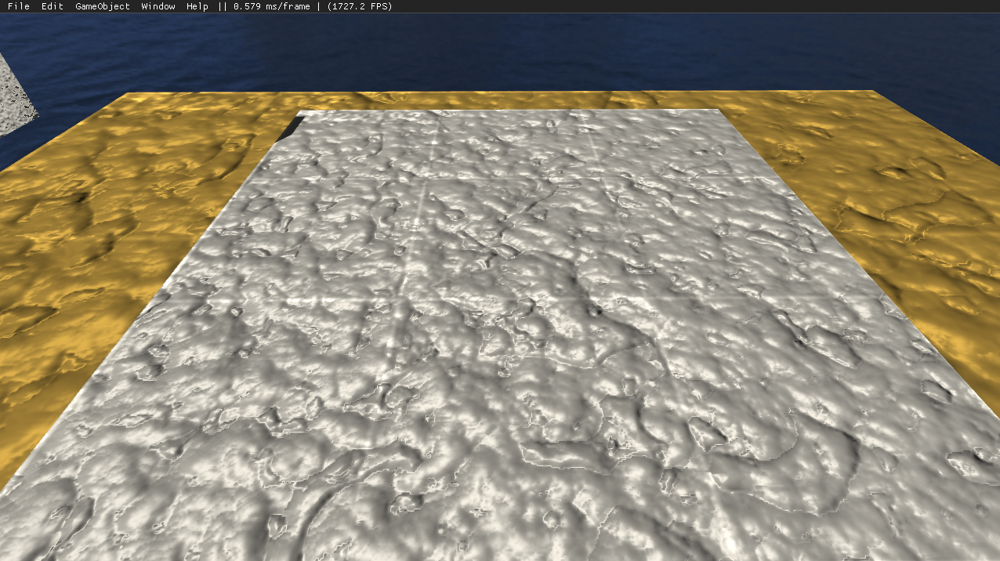

# Nebula_Engine
Nebula Engine is a small rendering framework for the third semester at the sae institute. The ambition was to create a small, easy-to-use 
framework in OpenGL. Still working on this project.

Contributions and general support are welcome.

# Screenshots

# Documentation
Download nebula and navigate to Documentation -> html -> and open index.html in your webbrowser

# How to compile
1. Download the Windows 10 SDK (https://developer.microsoft.com/en-us/windows/downloads/windows-10-sdk/)
2. Open the Nebula_Engine.sln
3. Choose Debug mode and x86
4. Right click the solution and retarget the project.
5. Press "Local Windows Debugger"
6. Look around with the mouse, move around with WASD
7. Press 'Left-SHIFT' for faster movement

# SDKs
* [GLM](https://glm.g-truc.net/0.9.9/index.html) - Math Library
* [GLFW](https://www.glfw.org/) - Window creation and handling
* [GLEW](http://glew.sourceforge.net/) - Modern OpenGL
* [FMOD](https://www.fmod.com/) - 2D/3D Audio Engine
* [ImgUi](https://github.com/ocornut/imgui) - UI System

# Documentation tool
* [Doxygen](http://www.doxygen.nl/) - Documentation tool for HTML files

# ToDo List
* Entity-Component System
* HDR implementation
* Soft Shadows, fixing some issues with the shadow system
