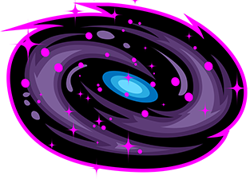

  

# Nebula_Engine
3. Semester SAE Diploma Project written in C++ with OpenGL. The main goal was to create an easy-to-use framework for game developers. Got inpired by panda3D. 

## Documentation
Download nebula and navigate to Documentation -> html -> and open index.html in your webbrowser

## SDKs

* [GLM](https://glm.g-truc.net/0.9.9/index.html) - Math Library
* [GLFW](https://www.glfw.org/) - Window creation and handling
* [GLEW](http://glew.sourceforge.net/) - Modern OpenGL
* [FMOD](https://www.fmod.com/) - 2D/3D Audio Engine
* [ImgUi](https://github.com/ocornut/imgui) - UI System

## Documentation tool

* [Doxygen](http://www.doxygen.nl/) - Documentation tool for HTML files

## ToDo List

* HDR implementation
* Entity-Component System
* Correct linkings for the imgui system
* Soft Shadows, fixing some issues with the shadow system
